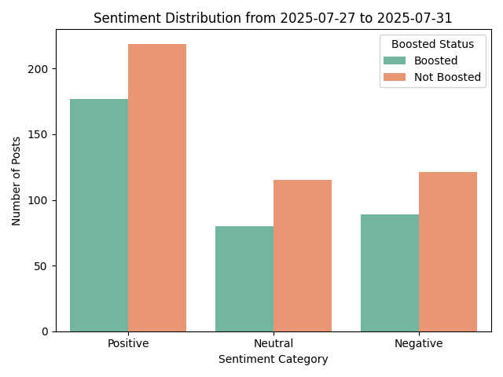

# sentimasto

Sentiment analysis for your mastodon feed - categorise your timeline by 
positive/negative or neutral feelings.

## Features

* Fetches toots from your home timeline for a given day
* Strips HTML content using BeautifulSoup
* Identifies boosted posts
* Filters toots containing muted words from an external `muted_words.txt` file
* Create a log of skipped authors for auditing
* Saves filtered toots as a json file for sentiment analysis
* Performs sentiment analysis using VADER
* Generates visual summary of sentiment breakdown

## Preparation

Clone this repository, and create a virtual environment and install the
necessary packages (one-time operation)

```
virtualenv venv
source venv/bin/activate
pip install -r requirements.txt
```


### Muted words

Create a muted_words.txt file with terms you'd like to exclude. An example has
been provided containing the words:

```
Trump
Brexit
```

Either remove this file or create an empty one to disable muted words.
Otherwise check your own mastodon filters and add them to this file.

### Access token

In the mastodon UI, click Preferences -> Development -> New Application
Give the application a name (e.g. sentimasto), and allow read access.
Once done, click on the new app and copy the key from "Your access token" 
into a text file called `token.txt`.

## Running the script

Run the grab_toots.py script with a date in ISO format e.g. 

```
python grab_toots.py 2025-07-29
```

Then run the sentiment analysis for a given date range that we have obtained json files for:

```
python analyse_sentiment.py 2025-07-27 2025-07-31
```

You should get a visual result similar to 

## Issues

I cannot obtain toots more than a few days old - I think this is due to an 800
toot limit perhaps. Currently I am collecting daily json files since my timeline is only ~200 toots per day.
Suggestions welcome.
